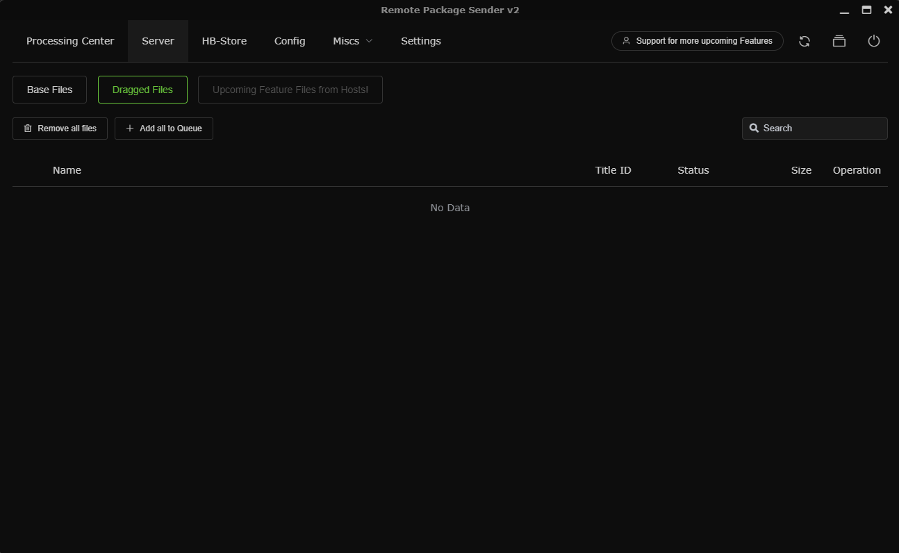

# Installing games

## Preparing

1. Copy `RemotePKG_Sender_FOR_PS4.pkg` on USB Flash Drive
2. Go into Goldhen at the top left of the home screen
3. Go into `Debug Settings`
4. Under Package Installer make sure Package Source is `usb[ usb:/ ]` *if it is Hdd [ hdd:/data/pkg/ ] change it to usb[ usb:/ ]*
5. Go into Package Installer
6. Open the pkg file `RemotePKG_Sender_FOR_PS4.pkg` and install it

## PS4 **WIRELESS METHOD**

### PS4 
1. Make sure that your **PS4** and **PC** connected to the same **network**
2. Go into Goldhen at the top left of the home screen, press `Server settings`
3. Enable the first mark, also enable BinLoader (it is not necessary, but you can try)
4. Go to the network settings, and click on `View connection status`. There you will see IP address of the console
### PC
1. Open the `RemotePackageSenderPS4.exe`
2. Go to `Config` 
3. Check `Port` - select 9090 if it is not selected
4. Configure Playstation IP - enter there ONLY IP address of the PS4 (watch that in `View connection status` on PS4, if it isn't opened)
5. Press `Test connection`. If everything goes good, you will see green window `above`

## PS4 **ETHERNET METHOD**
### PC
1. Connect both devices via ethernet cable
2. On your PC go into Start>Settings>Network & Internet>Ethernet and then at the top right choose *Change Adapter Options*     
    
6. Find the ethernet Adapter you are using and right click on it then choose *properties*            
7. Double left click on *Internet Protocol Version 4 (TCP/IPv4)*              
          
8. Press on the empty circle next to *Use the following IP address:* to unlock the fields below it       
       
9. Fill them in to match as shown in the image below        
      
### PS4
**Go to your PS4 and go into `Settings -> Network -> Set Up Internet Connection`**
1. Choose `Use a LAN Cable` then choose `Custom` then choose `Manual `
2. Set *IP Address* to **192.168.0.2**  
3. Set *Subnet Mask* to **255.255.255.0**   
4. Set *Default Gateway* to **0.0.0.0**
5. Set *Primary DNS* to **192.168.0.1**  
6. Set *Secondary DNS* to **0.0.0.0**  
7. Set *MTU Settings* to `Automatic` Set *Proxy Server* to **Do Not Use**      
8. Test Internet Connection and once you get an IP Adresss go back to the home screen      
9. Go into Goldhen at the top left of the home screen     
10. Go into `Server Settings`
11. Enable the first mark, also enable BinLoader (it is not necessary, but you can try)

### PC again
1. Open the `RemotePackageSenderPS4.exe`
2. Go to `Config` 
3. Check `Port` - select 9090 if it is not selected
4. Also check Server IP - it must be **192.168.0.1** (ip of your pc, which was configured in the **6th step of PC**)
4. Configure Playstation IP - enter there **192.168.0.2**
5. Press `Test connection`. If everything goes good, you will see green window `above`

## Installing (finally)
1. Download PS4 **game.pkg** from any sources (pinned at the [bottom](#game-sources) )
2. Also download updates for the **game**
3. Open the `RemotePackageSenderPS4.exe`
4. Make sure, that your `PS4` and `PC` are connected to each other (**wireless method** or **ethernet method**, that are [above](#ps4-wireless-method))
5. Open the `RemotePackageSender` on **PS4**, then, go to **PC**
4. Check config. There you can choose pgk base path.  
5. 
* Go to `Server` and choose `Dragged files` if you haven't chose pkg base path  
* Drag there your game files - game and updates for it *if it is necessary*
* If you have chosen pkg base path, you can select `Base files` there  
6. Press the `Plus` button in the left of the package, so you add it at the queue
7. Go to `Processing center` and press the second button (play button)

8. Wait for installing. After you have installed game, you **can** install **update pkgs** for the game by **this method**.
9. **If you have installed games or updates, you can close the applications and run programs. Cables can be unplugged too.**

## Game Sources
https://dlpsgame.com/category/ps4/

https://www.superpsx.com/category/ps4/

